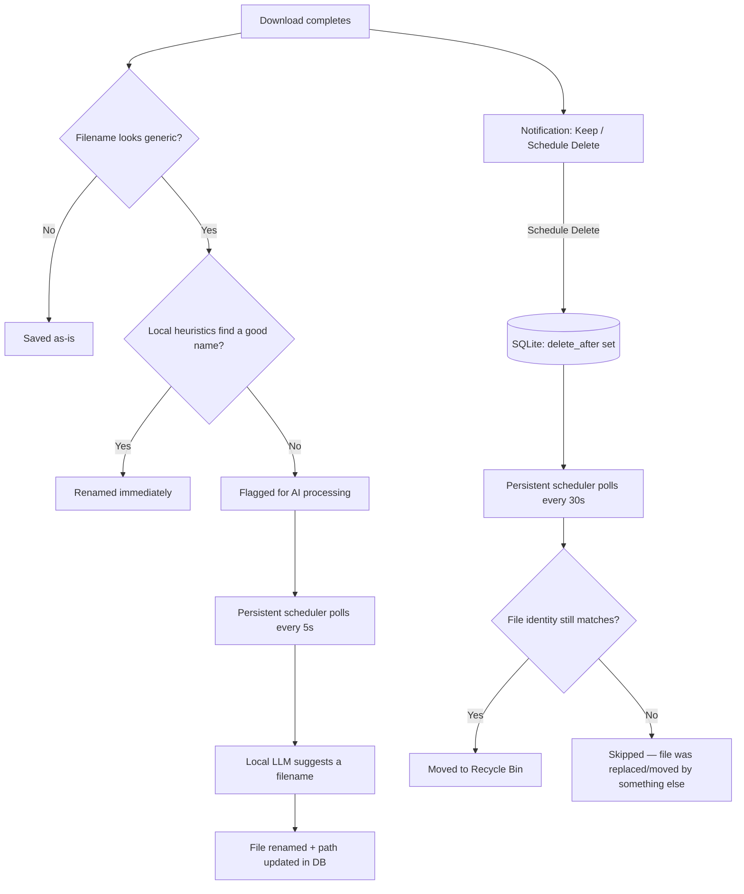

# CleanDrop

**A smart download manager for Chrome that renames, tracks, and safely auto-expires your downloads — entirely on your own machine.**

CleanDrop watches your downloads, gives cryptic filenames a real name (using a locally-run LLM — nothing ever leaves your machine), and lets you schedule files for deletion with a single click. No cloud services, no telemetry, no account required.

---

## Features

- **One-click expiry.** A native notification appears after each download with **Keep** / **Schedule Delete**, plus a custom-duration option — no modal dialogs interrupting your browsing.
- **Smart renaming.** Generic filenames (`IMG_2043.jpg`, `download (7).pdf`, CDN-mangled names) are detected automatically and renamed using page context — first with fast local heuristics, falling back to a locally-run LLM when heuristics aren't enough.
- **Identity-based safety.** Files are tracked by their actual filesystem identity (NTFS volume + file ID), not by path. Renaming or moving a tracked file doesn't break its schedule, and CleanDrop verifies identity before ever touching a file, so it can't accidentally delete the wrong one.
- **Recycle Bin, not `rm`.** Scheduled deletions go to the Recycle Bin via the Windows Shell API — always recoverable, never a silent permanent delete.
- **100% local.** The companion app, the database, and the LLM inference all run on your machine. No data is ever sent anywhere except to the local model server on `127.0.0.1`.

---

## How it works



CleanDrop is split into two separate pieces on purpose:

| Component | Lifetime | Responsibility |
|---|---|---|
| `cleandrop-host.exe` | **Launched fresh by Chrome per download**, exits immediately after responding | Records the download and its filesystem identity |
| `cleandrop-scheduler.exe` | **Runs continuously**, started once at login via Task Scheduler | Polls for expired downloads (delete) and pending renames (AI) |

This split exists because Chrome's native messaging (`sendNativeMessage`) kills the host process the instant it replies — any background work started inside that process (a thread waiting on an LLM call, a scheduler loop) gets silently killed mid-flight. Long-running work has to live in a process Chrome doesn't control the lifecycle of.

---

## Installation

**Requirements:** Windows, Python 3.10+, Google Chrome, a local OpenAI-compatible LLM server (e.g. [llama.cpp](https://github.com/ggerganov/llama.cpp)'s built-in server) for the renaming feature.

1. **Clone the repo and install dependencies:**
   ```powershell
   git clone https://github.com/its-nott-me/CleanDrop
   cd CleanDrop/companion
   pip install -r requirements.txt
   ```

2. **Build the two native executables:**
   ```powershell
   pyinstaller cleandrop-host.spec
   pyinstaller cleandrop-scheduler.spec
   ```

3. **Register the native messaging host.** Edit `native-host/com.cleandrop.host.json` so `"path"` points to your built `cleandrop-host.exe`, then import the registry key:
   ```powershell
   reg import native-host\install-host.reg
   ```

4. **Load the extension.** Go to `chrome://extensions`, enable Developer Mode, and "Load unpacked" pointing at the `extension/` folder. Copy the extension ID Chrome assigns into `allowed_origins` in `com.cleandrop.host.json`.

5. **Schedule the background service** to start at login:
   ```powershell
   schtasks /create /tn "CleanDrop Scheduler" /tr '"path\to\cleandrop-scheduler.exe"' /sc onlogon /f
   schtasks /run /tn "CleanDrop Scheduler"
   ```

6. **Start your local LLM server** on `127.0.0.1:8080` (or update `LLAMA_URL` in `companion/ai/filename_model.py` to match your setup) if you want smart renaming.

---

## Development

Run the test suite:
```powershell
cd companion
python -m pytest test_*.py -v
```

Inspect the local database directly:
```powershell
python check_db.py       # recent downloads
python check_schema.py   # verify table schema
```

---

## Privacy

Everything runs locally: the SQLite database lives at `~/.cleandrop/cleandrop.db`, and filename suggestions are generated by a model you run yourself on `127.0.0.1` — nothing is sent to any third party. The only network permission the extension requests is for reading page titles/descriptions on pages you download from, used purely to improve local renaming suggestions.

## License

MIT — see [LICENSE](LICENSE).