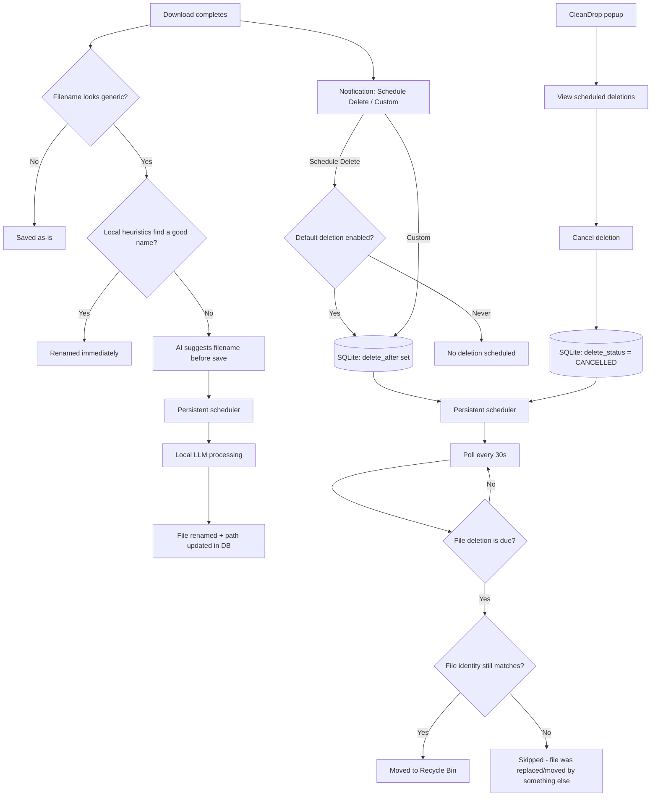

# CleanDrop

**A smart download manager for Chrome that renames, tracks, and safely auto-expires your downloads - entirely on your own machine.**

CleanDrop watches your downloads, gives cryptic filenames a real name (using a locally-run LLM - nothing ever leaves your machine), and lets you schedule files for deletion with a single click. No cloud services, no telemetry, no account required.

---

## Features

* **One-click expiry.** A native notification appears after each download with **Schedule Delete** and a custom-duration option - no modal dialogs interrupting your browsing.
* **Configurable default deletion time.** Choose the default delay used by **Schedule Delete** directly from CleanDrop's extension popup, including options such as hours, days, or **Never**. The setting persists across browser restarts.
* **Scheduled-deletion management.** Click the CleanDrop extension icon to open the popup and view all currently scheduled deletions, including their filenames and deletion times. Any scheduled deletion can be cancelled from the popup.
* **Persistent scheduling.** Scheduled deletions are stored in CleanDrop's local SQLite database and processed by the continuously running scheduler. Cancelling a deletion changes its status rather than removing its database record, so the scheduler safely ignores it.
* **Smart renaming.** Generic filenames (`IMG_2043.jpg`, `download (7).pdf`, CDN-mangled names) are detected automatically and renamed using page context - first with fast local heuristics, falling back to a locally-run LLM when heuristics aren't enough.
* **Identity-based safety.** Files are tracked by their actual filesystem identity (NTFS volume + file ID), not by path. Renaming or moving a tracked file doesn't break its schedule, and CleanDrop verifies identity before ever touching a file, so it can't accidentally delete the wrong one.
* **Recycle Bin, not `rm`.** Scheduled deletions go to the Recycle Bin via the Windows Shell API - always recoverable, never a silent permanent delete.
* **100% local.** The companion app, the database, and the LLM inference all run on your machine. No data is ever sent anywhere except to the local model server on `127.0.0.1`.
* **GUI installer and uninstaller.** CleanDrop includes a Windows GUI installer that lets you choose the installation directory and installs the companion components, extension resources, and uninstaller. The uninstaller is registered with Windows and can be launched from Installed Apps.

---

## How it works



CleanDrop is split into two separate pieces on purpose:

| Component                 | Lifetime                                                                                      | Responsibility                                                                                |
| ------------------------- | --------------------------------------------------------------------------------------------- | --------------------------------------------------------------------------------------------- |
| `cleandrop-host.exe`      | **Launched fresh by Chrome per native-messaging request**, exits immediately after responding | Handles filename suggestions and records scheduled downloads in SQLite                        |
| `cleandrop-scheduler.exe` | **Runs continuously**, started once at login via Task Scheduler                               | Polls for expired downloads every 30 seconds and runs the local LLM watchdog every 15 seconds |

This split exists because Chrome's native messaging (`sendNativeMessage`) kills the host process the instant it replies - any background work started inside that process (a thread waiting on an LLM call, a scheduler loop) gets silently killed mid-flight. Long-running work has to live in a process Chrome doesn't control the lifecycle of.

The extension popup communicates with the native host to read scheduled deletions and cancel them. A cancellation changes the SQLite row to `CANCELLED`; the row is intentionally retained so the scheduler can distinguish a cancelled deletion from an untracked download.

---

## Installation

**Requirements:** Windows, Google Chrome, and optionally a local OpenAI-compatible LLM server for the smart-renaming feature.

### Build the installer

From `installer/`:

1. **Build the companion executables:**

   ```powershell
   pyinstaller ..\companion\cleandrop-host.spec
   pyinstaller ..\companion\cleandrop-scheduler.spec
   ```

2. **Build the GUI uninstaller:**

   ```powershell
   pyinstaller uninstall.spec
   ```

3. **Prepare the installer resources:**

   ```powershell
   python prepare_resources.py
   ```

   This copies the companion executables, GUI uninstaller, and extension into `installer/resources/`.

4. **Build the GUI installer:**

   ```powershell
   pyinstaller wizard.spec
   ```

5. Run the generated installer from `installer/dist/`. The installer lets the user choose the CleanDrop installation directory, registers the Chrome native-messaging host and scheduler, and installs the uninstaller separately from the main application directory.

### Uninstall

CleanDrop's uninstaller is registered with Windows, so it can be removed through:

**Windows Settings → Apps → Installed apps → CleanDrop → Uninstall**

The uninstaller stops CleanDrop's processes, removes the scheduled task and native-messaging registration, removes CleanDrop's application files and local app data, and removes its Windows uninstall registration.

The CleanDrop-owned llama.cpp runtime installed inside the CleanDrop installation directory is removed with the application. Uninstalling CleanDrop does not remove unrelated llama.cpp or `llama-server.exe` installations belonging to other applications.

---

## Development

Run the test suite:

```powershell
cd companion
python -m pytest test_*.py -v
```

Inspect the local database directly:

```powershell
python check_db.py       # recent downloads
python check_schema.py   # verify table schema
```

---

## Privacy

Everything runs locally: the SQLite database lives at `~/.cleandrop/cleandrop.db`, and filename suggestions are generated by a model you run yourself on `127.0.0.1` - nothing is sent to any third party. The only network permission the extension requests is for reading page titles/descriptions on pages you download from, used purely to improve local renaming suggestions.

## License

MIT - see [LICENSE](LICENSE).
